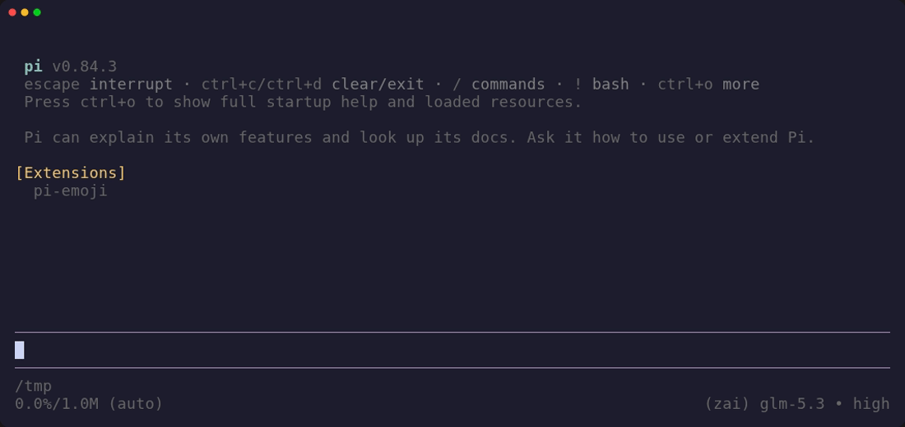

# pi-emoji

Emoji shortcodes for [Pi](https://github.com/badlogic/pi-mono). :3



- See `:wave:` as 👋 while keeping the submitted shortcode unchanged.
- Search and insert emoji with `/emoji`.
- Leave unknown shortcodes and Markdown code untouched.

## Install

```sh
pi install git:github.com/omarluq/pi-emoji
```
